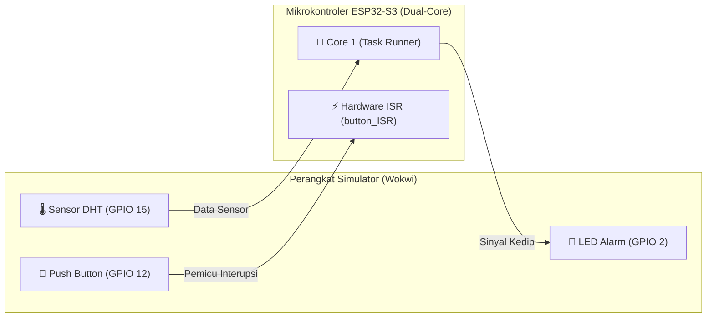
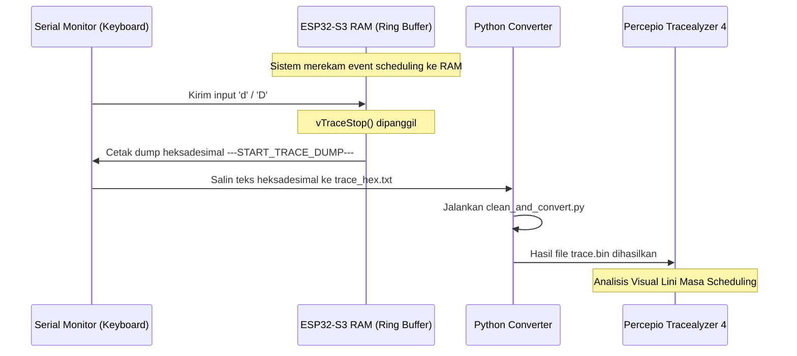

# Laporan Analisis Sistem: Secure Data Logger (ESP-IDF v6 & FreeRTOS SMP)

Dokumen ini menyajikan analisis mendalam mengenai proyek **Secure Data Logger** berbasis **ESP-IDF v6.0.1** dan **FreeRTOS SMP (Symmetric Multiprocessing)** yang berjalan pada chip **ESP32-S3**. Laporan ini mencakup visualisasi I/O, alur logging serial, analisis rekam jejak eksekusi task (*task execution trace*), serta pembagian kontribusi anggota tim.

---

## 1. 🔌 Visualisasi Virtual I/O & Wiring Diagram

Sistem disimulasikan menggunakan **Wokwi Simulator** dengan konfigurasi pinout yang dideklarasikan di dalam berkas [diagram.json](file:///c:/Users/Lenovo-ex/Documents/RTOSProject/diagram.json) dan dikendalikan oleh kode utama [main/main.cpp](file:///c:/Users/Lenovo-ex/Documents/RTOSProject/main/main.cpp).

### Skema Sambungan Pin (Pinout Mapping)

| Komponen | Pin ESP32-S3 | Mode GPIO | Fungsi |
| :--- | :---: | :---: | :--- |
| **Sensor DHT11/DHT22** | **GPIO 15** | Input | Membaca data suhu lingkungan secara berkala. |
| **Push Button (Active Low)** | **GPIO 12** | Input Pull-Up | Tombol fisik untuk memicu simulasi sabotase fisik (*physical tampering*). |
| **LED Alarm (Active High)** | **GPIO 2** | Output | Indikator visual berupa kedipan cepat ketika terjadi pelanggaran keamanan. |
| **Serial/UART** | **TX/RX Pins** | I/O | Media komunikasi untuk mentransmisikan log sensor dan *binary trace dump*. |

### Diagram Blok Koneksi (Virtual Connection)



---

## 2. 📝 Aliran Logging & Analisis Serial Log

Pencetakan informasi ke Serial Monitor dirancang dengan mekanisme sinkronisasi yang ketat menggunakan **Mutex (`xSerialMutex`)**. Di lingkungan multi-core ESP32-S3, Mutex ini wajib digunakan untuk menjamin mutual exclusion agar teks logs dari task-task yang berbeda core tidak saling tumpang tindih (*interleaved logs*).

### Format Keluaran Serial Standar
Setiap data sensor yang diproses dicetak secara teratur oleh `SerialTask` (Prioritas 1) dengan struktur log berikut:
```text
[LOG] Plaintext Suhu: 26.50 C | Ciphertext (Enkripsi): 6B 6F 78 78 
[MONITOR STACK] Sisa Memory Ruang Kerja Task ini: 1848 bytes
------------------------------------------------
```
*   **Plaintext Suhu**: Nilai suhu asli hasil pembacaan berkala dari sensor DHT.
*   **Ciphertext (Enkripsi)**: Representasi heksadesimal dari string suhu yang telah dikaburkan menggunakan enkripsi XOR bitwise dengan kunci rahasia `'K'`.
*   **Monitor Stack**: Hasil pantauan sisa ruang stack yang dialokasikan untuk task tersebut (`uxTaskGetStackHighWaterMark()`). Angka dalam satuan *bytes* ini menunjukkan batas aman pemakaian memori untuk mencegah *stack overflow*.

### Aliran Peringatan Keamanan (Tampering Alert)
Ketika tombol fisik (tamper button) ditekan, sistem interupsi langsung melompati pipeline sensor dan mencetak peringatan berprioritas tinggi:
```text
================================================
[WARNING] PHYSICAL TAMPERING DETECTED! ALARM ACTIVE!
================================================
```
*   Secara bersamaan, `AlertTask` akan mengambil alih kontrol LED dan mengedipkannya dengan cepat sebanyak 6 kali untuk memberi peringatan visual instan di lapangan.

---

## 3. ⏱️ Rekam Jejak Eksekusi Task (Task Execution Tracealyzer)

Untuk menganalisis perilaku waktu-nyata (*real-time behavior*) dan performa penjadwalan (*scheduling*), proyek ini mengintegrasikan **Percepio Tracealyzer Recorder** secara native.

### Alur Kerja Pengambilan Data Trace (Dumping Trace)



### Langkah Rekonsiliasi & Visualisasi Trace:
1.  **Dumping data**: Ketika program berjalan, ketik karakter **`d`** atau **`D`** di Serial Monitor untuk memerintahkan ESP32-S3 memuntahkan seluruh buffer jejak aktivitas (*ring buffer recorder*) dalam bentuk string heksadesimal.
2.  **Pembersihan & Konversi**:
    *   String heksadesimal dari Serial Monitor disalin ke berkas `trace_hex.txt`.
    *   Jalankan script Python [clean_and_convert.py](file:///c:/Users/Lenovo-ex/Documents/RTOSProject/clean_and_convert.py) untuk menyaring karakter non-hex dan menerjemahkannya kembali ke format biner mentah.
    *   Script akan menghasilkan berkas **`trace.bin`** di root folder.
3.  **Analisis Visual**: Buka file `trace.bin` menggunakan aplikasi **Percepio Tracealyzer 4** untuk menginspeksi:
    *   Gantt chart eksekusi antar-task.
    *   Latensi interupsi (*interrupt latency*) dari tombol hingga lampu menyala.
    *   Frekuensi penguncian dan pelepasan Mutex UART.

---

## 4. 👥 Pembagian Kontribusi & Tanggung Jawab Anggota Tim

Proyek ini dibagi secara modular ke dalam 4 bidang tanggung jawab utama untuk memastikan kolaborasi tim berjalan selaras dengan prinsip rekayasa sistem embedded (*embedded software engineering*):

### 🧑‍💻 Anggota 1: Task Management & Scheduling (Prioritas Tinggi - Menengah)
*   **Tanggung Jawab**: Merancang arsitektur penjadwalan multithreading dan siklus eksekusi task periodik.
*   **Kontribusi Kode**: 
    *   Mengatur prioritas dari masing-masing task di dalam `setup()` agar sesuai dengan kaidah *Rate Monotonic Scheduling (RMS)*.
    *   Mengimplementasikan fungsi `vTaskSensorAcquisition` (Task 2, prioritas 3) untuk melakukan pembacaan periodik non-blocking setiap 1000 ms dari sensor DHT.

### 🧑‍💻 Anggota 2: Inter-Task Synchronization & Data Encryption (Prioritas Menengah)
*   **Tanggung Jawab**: Menjamin integritas data yang dikirim antar-task dan merancang proteksi keamanan data sensor.
*   **Kontribusi Kode**:
    *   Mengimplementasikan pembuatan **Queues** (`xSensorQueue` dan `xProcessedQueue`) untuk mentransfer data sensor antar-task secara *thread-safe* tanpa risiko *race condition*.
    *   Mengimplementasikan fungsi `vTaskCryptoProcess` (Task 3, prioritas 2) yang bertugas mendekripsi/enkripsi data suhu secara lokal menggunakan sandi XOR bitwise dengan konstanta kunci `KUNCI_XOR = 'K'`.

### 🧑‍💻 Anggota 3: ISR (Interrupt Service Routine) & Deferred Processing (Prioritas Tertinggi)
*   **Tanggung Jawab**: Merancang sistem tanggap darurat (*event-driven alarm*) terhadap gangguan fisik luar secara instan.
*   **Kontribusi Kode**:
    *   Mengonfigurasi interupsi hardware eksternal pada GPIO 12 (`button_ISR()`) dengan mode interupsi `FALLING` edge.
    *   Mengimplementasikan teknik **Deferred Interrupt Processing** menggunakan **Task Notification** (`vTaskNotifyGiveFromISR` dan `ulTaskNotifyTake`) untuk membangunkan `vTaskAlertSystem` (Task 1, prioritas 4) secara instan guna mengedipkan lampu LED alarm tanpa membebani rutinitas ISR.

### 🧑‍💻 Anggota 4: Memory, I/O Management & Log (Prioritas Terendah - Pipeline)
*   **Tanggung Jawab**: Memantau kesehatan memori sistem serta memastikan kelancaran komunikasi I/O serial multi-core.
*   **Kontribusi Kode**:
    *   Membuat mekanisme gembok **Mutex (`xSerialMutex`)** untuk mengamankan port UART agar pesan log debugging dan dump Tracealyzer tidak rusak ketika diakses bersamaan oleh Core 0 dan Core 1.
    *   Mengimplementasikan fungsi `vTaskSerialOutput` (Task 4, prioritas 1) untuk mencetak string data sensor ke Serial Monitor secara teratur.
    *   Menambahkan instrumentasi performa berupa pelacakan pemakaian memori stack task via `uxTaskGetStackHighWaterMark()`.

---

## 5. 🛡️ Ringkasan Fitur Keandalan RTOS

Sistem ini didesain tangguh terhadap kegagalan khas sistem waktu-nyata (*real-time system failures*):
1.  **Priority Inheritance**: FreeRTOS secara otomatis menaikkan prioritas task prioritas rendah jika ia memegang `xSerialMutex` yang sedang dinanti oleh task prioritas tinggi (`AlertTask`). Hal ini meminimalkan durasi terjadinya **Priority Inversion**.
2.  **Multi-Core Task Pinning**: Semua task disematkan secara spesifik ke Core 1 (`xTaskCreatePinnedToCore` dengan parameter core ID `1`) untuk memastikan Core 0 tetap bebas mengelola tumpukan protokol radio (WiFi/Bluetooth bawaan ESP32) secara independen.

---

## 6. 🧮 Analisis Schedulability (LUB & RTA)

Untuk membuktikan ketepatan waktu penjadwalan secara matematis di bawah model Rate Monotonic Scheduling (RMS), proyek ini mengintegrasikan pengujian **LUB (Least Upper Bound)** dan **RTA (Response Time Analysis)**. Perhitungan ini dijalankan secara berkala pada runtime oleh `SerialTask` untuk memberikan analisis schedulability real-time di Serial Monitor.

### A. Model Parameter Task
Model waktu respons didasarkan pada parameter tugas berikut (dalam milidetik):

| Task | Prioritas | $C_i$ (Waktu Komputasi) | $T_i$ (Periode) | $D_i$ (Deadline) | Keterangan |
| :--- | :---: | :---: | :---: | :---: | :--- |
| **`AlertTask`** | 4 | 0.0120 ms | 5000.0 ms | 5000.0 ms | Sporadis (Penanganan Tamper) |
| **`SensorTask`** | 3 | 26.5000 ms | 2000.0 ms | 2000.0 ms | Periodik (Akuisisi Data) |
| **`CryptoTask`** | 2 | 0.0500 ms | 2000.0 ms | 2000.0 ms | Pipeline (Enkripsi XOR) |
| **`SerialTask`** | 1 | 5.2000 ms | 2000.0 ms | 2000.0 ms | Pipeline (Serial Output) |

### B. Uji LUB (Least Upper Bound) — Sufficient Condition
Uji LUB menentukan apakah total utilisasi CPU berada di bawah batas teoretis maksimum di mana sistem dijamin 100% schedulable:

$$U = \sum_{i=1}^{n} \frac{C_i}{T_i} \leq n \cdot (2^{1/n} - 1)$$

Untuk $n = 4$ task, batas LUB adalah:
$$U_{LUB} = 4 \cdot (2^{1/4} - 1) \approx 0.756828\ (75.6828\%)$$

Total utilisasi pada sistem ini:
$$U_{total} = \frac{0.012}{5000} + \frac{26.5}{2000} + \frac{0.05}{2000} + \frac{5.2}{2000} \approx 0.015877\ (1.5877\%)$$

Karena **$U_{total} \leq U_{LUB}$** ($1.5877\% \leq 75.6828\%$), sistem ini **PASS** uji LUB dan dijamin dapat dijadwalkan secara aman tanpa ada task yang melebihi deadline.

### C. Response Time Analysis (RTA) — Exact Test
Uji RTA menghitung waktu respons terburuk ($R_i$) dari setiap task secara iteratif dengan memperhitungkan interferensi dari task dengan prioritas lebih tinggi ($hp(i)$):

$$R_i^{(n+1)} = C_i + \sum_{j \in hp(i)} \left\lceil \frac{R_i^{(n)}}{T_j} \right\rceil \cdot C_j$$

Hasil iterasi RTA untuk masing-masing task adalah sebagai berikut:
*   **$R(\text{AlertTask}) = 0.0120\text{ ms} \leq 5000\text{ ms}$** [PASS]
*   **$R(\text{SensorTask}) = 26.5120\text{ ms} \leq 2000\text{ ms}$** [PASS] (Terhambat 1 kali eksekusi `AlertTask`)
*   **$R(\text{CryptoTask}) = 26.5620\text{ ms} \leq 2000\text{ ms}$** [PASS] (Terhambat 1 kali `AlertTask` & 1 kali `SensorTask`)
*   **$R(\text{SerialTask}) = 31.7620\text{ ms} \leq 2000\text{ ms}$** [PASS] (Terhambat 1 kali `AlertTask`, `SensorTask`, & `CryptoTask`)

Seluruh task memiliki waktu respons terburuk yang jauh di bawah deadline masing-masing ($R_i \leq D_i$), mengonfirmasi keandalan *real-time* sistem ini.
