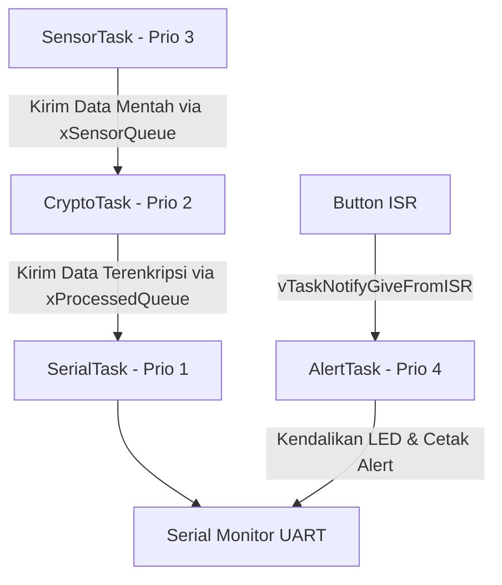

# Panduan Tutorial & Praktik Terbaik: Secure Data Logger (ESP-IDF v6)

Dokumen ini menjelaskan arsitektur sistem, petunjuk langkah demi langkah penggunaan, serta rekomendasi praktik terbaik (*best practices*) untuk pengembangan lebih lanjut menggunakan **ESP-IDF v6** dan **Percepio Tracealyzer**.

---

## 1. Arsitektur Proyek & Aliran Kerja

Proyek ini bermigrasi dari Arduino IDE ke native **ESP-IDF v6.0.1** dengan memanfaatkan kernel **FreeRTOS SMP (Symmetric Multiprocessing)** multi-core pada ESP32-S3. Sistem menjalankan 4 task utama yang saling berinteraksi secara aman (*thread-safe*):



1. **`AlertTask` (Prioritas 4 - Tertinggi)**: Dibangunkan secara instan menggunakan mekanisme *Deferred Interrupt Processing* ketika tombol fisik ditekan (memicu Hardware ISR). Task ini mengendalikan kedipan cepat LED alarm.
2. **`SensorTask` (Prioritas 3 - Tinggi)**: Membaca sensor suhu DHT22 secara periodik setiap 1 detik.
3. **`CryptoTask` (Prioritas 2 - Sedang)**: Mengambil data dari antrean, mengenkripsi suhu dengan metode XOR sederhana, dan memasukkannya ke antrean cetak.
4. **`SerialTask` (Prioritas 1 - Terendah)**: Menampilkan hasil log data terenkripsi dan memantau sisa stack memory masing-masing task.

---

## 2. Panduan Langkah Penggunaan

### Langkah 2.1: Persiapan Port & Flashing Firmware
1. Sambungkan papan ESP32-S3 ke komputer Anda.
2. Buka berkas [flash_monitor.bat](file:///c:/Users/muham/Documents/Documents/Secure_Data_Logger-main/Secure_Data_Logger-main/flash_monitor.bat).
3. Sesuaikan port COM (`-p COM6`) dengan nomor port COM yang terdeteksi di Device Manager komputer Anda.
4. Jalankan script tersebut dengan masuk ke folder proyek dan mengeksekusinya:
   ```powershell
   cd Secure_Data_Logger-main
   .\flash_monitor.bat
   ```
   *Script ini secara otomatis mengompilasi kode, mengunggah program, dan membuka Serial Monitor.*

### Langkah 2.2: Pemicuan Dump Tracealyzer
1. Biarkan aplikasi berjalan beberapa saat agar riwayat penjadwalan tersimpan ke dalam Ring Buffer memori RAM.
2. Tekan tombol keyboard **`d`** atau **`D`** pada Serial Monitor untuk memicu dumping memori.
3. Di layar monitor akan muncul teks dump heksadesimal yang diawali `---START_TRACE_DUMP---` dan diakhiri `---END_TRACE_DUMP---`.
4. Salin (copy) seluruh baris heksadesimal tersebut (dari angka pertama hingga terakhir).

### Langkah 2.3: Konversi Hex ke Binary
1. Tempelkan (paste) string hex tersebut ke dalam berkas [trace_hex.txt](file:///c:/Users/muham/Documents/Documents/Secure_Data_Logger-main/trace_hex.txt).
2. Buka terminal Anda dan jalankan perintah berikut untuk mengonversi data hex menjadi file binary:
   ```powershell
   C:\Espressif\tools\python\v6.0.1\venv\Scripts\python.exe clean_and_convert.py
   ```
3. Berkas **`trace.bin`** yang valid akan dihasilkan di folder root Anda.

### Langkah 2.4: Analisis di Percepio Tracealyzer
1. Jalankan aplikasi **Percepio Tracealyzer 4**.
2. Pilih menu **File** -> **Open...** lalu pilih file **`trace.bin`**.
3. Tracealyzer akan menampilkan lini masa scheduling visual secara mendetail.

---

## 3. Rekomendasi Praktik Terbaik (Best Practices)

### 3.1. Pengamanan Akses UART (Serial Mutexing)
> [!IMPORTANT]
> Di lingkungan multi-core (SMP), beberapa task yang berjalan di core berbeda dapat menulis ke port Serial secara bersamaan. Hal ini memicu tabrakan karakter (*interleaved logs*) yang dapat merusak struktur data hex dump.
* **Praktik Baik**: Selalu bungkus kode pencetakan UART sensitif di dalam gembok Mutex (`xSerialMutex`).
* **Implementasi**:
  ```cpp
  if (xSemaphoreTake(xSerialMutex, portMAX_DELAY) == pdTRUE) {
      // Lakukan pencetakan data secara berurutan
      xSemaphoreGive(xSerialMutex);
  }
  ```

### 3.2. Penentuan Prioritas Task & Rate Monotonic Scheduling
* **Praktik Baik**: Tentukan prioritas task berdasarkan urgensi waktu (*deadline*). Task dengan *deadline* ketat atau yang dipicu oleh interupsi hardware (seperti `AlertTask`) harus memiliki prioritas tertinggi.
* Task yang bersifat I/O intensif (seperti menulis serial UART pada `SerialTask`) harus diberi prioritas lebih rendah untuk mencegah pemblokiran CPU (*starvation*) pada task kritis lainnya.

### 3.3. Pemantauan Ukuran Stack (High Water Mark)
> [!TIP]
> Mengalokasikan stack FreeRTOS terlalu besar akan memboroskan RAM, namun mengalokasikannya terlalu kecil akan memicu *Stack Overflow* yang merusak sistem.
* **Praktik Baik**: Pantau sisa stack secara periodik saat pengembangan menggunakan `uxTaskGetStackHighWaterMark()`. Nilai kembalian fungsi ini menunjukkan sisa stack minimum (dalam bytes/words) yang belum terpakai. Jika nilai mendekati `0`, segera naikkan ukuran stack task tersebut.

### 3.4. Keamanan Enkripsi Data (Production Grade)
* **Praktik Baik**: Enkripsi XOR yang digunakan saat ini hanya bersifat *obfuscation* (penyamaran ringan). Untuk kebutuhan produksi komersial, manfaatkan modul **mbedTLS** yang sudah terintegrasi secara native di ESP-IDF.
* Gunakan algoritma enkripsi simetris yang aman seperti **AES-128-GCM** atau **AES-256-CBC** dengan manajemen kunci (*Key Management*) yang ditaruh di dalam Secure Storage chip ESP32-S3 (seperti eFuse atau NVS Encryption).
