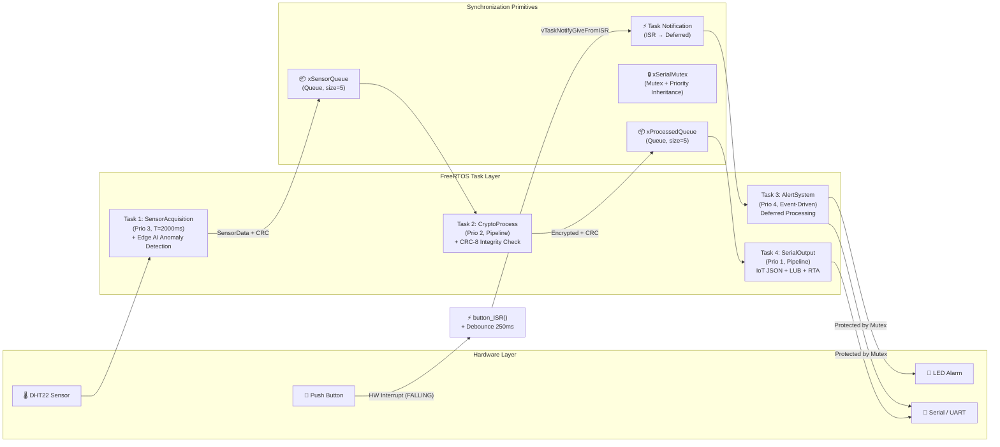

# Secure IoT Edge Node — FreeRTOS Schedulability Analysis

Proyek ini adalah **Secure IoT Edge Node** untuk logging data sensor suhu yang aman, menggunakan **FreeRTOS** pada mikrokontroler **ESP32**. Sistem ini mengintegrasikan:

- **Multitasking preemptive** dengan analisis schedulability **RMS (Rate Monotonic Scheduling)** meliputi uji **LUB (Least Upper Bound)** dan **RTA (Response Time Analysis)**
- **Sinkronisasi antar-task** menggunakan Queue, Mutex (dengan Priority Inheritance), dan Task Notification — bebas race condition dan deadlock
- **ISR singkat** dengan deferred processing via Task Notification dan debounce software
- **Manajemen memori komprehensif**: monitoring heap, stack semua task, alokasi statis, dan I/O ring buffer
- **Integrasi IoT & Edge AI**: deteksi anomali suhu (moving average), JSON payload siap MQTT, CRC-8 data integrity, dan Hardware Watchdog Timer

---

## 🚀 Fitur Utama

1. **Multi-tasking Preemptive (FreeRTOS)**: 4 task dengan penjadwalan berbasis prioritas sesuai Rate Monotonic Scheduling.
2. **Sensor Acquisition & Edge AI (Task 1)**: Membaca sensor DHT22 setiap **2000 ms** dengan deteksi anomali suhu menggunakan sliding window moving average — konsep Edge AI/ML untuk inferensi lokal di perangkat edge.
3. **Data Encryption & Integrity (Task 2)**: Mengenkripsi data suhu dengan XOR obfuscation, dilengkapi verifikasi **CRC-8** untuk data integrity check antar-task.
4. **Physical Tampering Alert (Task 3)**: Alarm interupsi fisik menggunakan ISR singkat (`< 10 μs`) dengan **deferred processing** via Task Notification. Dilengkapi **software debounce** (250 ms) untuk mencegah false trigger.
5. **IoT Gateway, Memory Monitor & Schedulability Analyzer (Task 4)**:
   - Format data sebagai **JSON payload** siap MQTT/HTTP (IoT readiness)
   - **I/O Ring Buffer** untuk efisiensi akses UART
   - Monitoring **heap** (`xPortGetFreeHeapSize`, `xPortGetMinimumEverFreeHeapSize`)
   - Monitoring **stack** semua 4 task (`uxTaskGetStackHighWaterMark`)
   - Analisis schedulability **LUB** (sufficient condition) dan **RTA** (exact test)
6. **Hardware Watchdog Timer**: Reset otomatis jika sistem hang — elemen safety-critical system.

---

## 📐 Arsitektur Sistem (Task Diagram)

Diagram berikut menunjukkan alur data dan mekanisme sinkronisasi antar-task:



---

## 📋 Model Parameter Penjadwalan Task

| Nama Task | Fungsi | Prioritas | Tipe | Periode ($T_i$) | Deadline ($D_i$) | Keterangan |
| :--- | :--- | :---: | :--- | :---: | :---: | :--- |
| **`AlertTask`** | `vTaskAlertSystem` | 4 | **Event-Driven** (Sporadic) | 5000 ms | 5000 ms | Hard RT, ISR + deferred processing |
| **`SensorTask`** | `vTaskSensorAcquisition` | 3 | Periodik | 2000 ms | 2000 ms | Akuisisi DHT22 + Edge AI anomaly |
| **`CryptoTask`** | `vTaskCryptoProcess` | 2 | Pipeline | 2000 ms | 2000 ms | Enkripsi XOR + CRC-8 verification |
| **`SerialTask`** | `vTaskSerialOutput` | 1 | Pipeline | 2000 ms | 2000 ms | Log, IoT JSON, LUB+RTA, memory |

> **Implicit Deadline**: $D_i = T_i$ (deadline sama dengan periode untuk semua task).

---

## ⏱️ Timing Diagram (Timeline Eksekusi Task)

Diagram waktu berikut menunjukkan pola eksekusi periodik setiap task selama 6 detik pertama operasi:

```mermaid
gantt
    title Timeline Eksekusi Task (6 Detik Pertama)
    dateFormat X
    axisFormat %s ms

    section SensorTask (P3, T=2s)
    Baca DHT22 + Anomaly Detection   :s1, 0, 50
    Baca DHT22 + Anomaly Detection   :s2, 2000, 50
    Baca DHT22 + Anomaly Detection   :s3, 4000, 50

    section CryptoTask (P2, Pipeline)
    Enkripsi XOR + CRC Verify        :c1, 50, 10
    Enkripsi XOR + CRC Verify        :c2, 2050, 10
    Enkripsi XOR + CRC Verify        :c3, 4050, 10

    section SerialTask (P1, Pipeline)
    Log + JSON + LUB + RTA           :o1, 60, 30
    Log + JSON + LUB + RTA           :o2, 2060, 30
    Log + JSON + LUB + RTA           :o3, 4060, 30

    section AlertTask (P4, Sporadic)
    ISR → Deferred LED Blink         :crit, a1, 3000, 1200
```



---

## 🔄 Sinkronisasi & Pencegahan Deadlock

### Mekanisme Sinkronisasi yang Digunakan

| Primitif | Objek | Digunakan Oleh | Tujuan |
| :--- | :--- | :--- | :--- |
| **Queue** | `xSensorQueue` | SensorTask → CryptoTask | Transfer data sensor secara thread-safe |
| **Queue** | `xProcessedQueue` | CryptoTask → SerialTask | Transfer data terenkripsi |
| **Mutex** | `xSerialMutex` | AlertTask, SerialTask | Mutual exclusion akses Serial/UART |
| **Task Notification** | via `xAlertTaskHandle` | ISR → AlertTask | Bangunkan task dari ISR (deferred processing) |

### Mengapa Sistem Bebas Deadlock

Sistem ini dijamin **bebas deadlock** karena:

1. **Tidak ada circular wait**: Setiap task hanya memegang maksimal 1 resource (Mutex) pada satu waktu. Tidak ada task yang mencoba mengambil resource kedua sambil memegang resource pertama.
2. **Timeout pada Mutex**: AlertTask menggunakan `xSemaphoreTake(xSerialMutex, pdMS_TO_TICKS(50))` dengan timeout 50ms — jika Mutex tidak tersedia, task melepas dan mencoba lagi, tidak menunggu selamanya.
3. **Ordering yang konsisten**: Semua task yang mengakses Serial mengikuti pola yang sama: ambil Mutex → cetak → lepas Mutex.

### Priority Inheritance (Pencegahan Priority Inversion)

FreeRTOS Mutex secara bawaan mengimplementasikan **Priority Inheritance Protocol**:

- Jika `SerialTask` (prioritas 1) sedang memegang `xSerialMutex`, dan `AlertTask` (prioritas 4) mencoba mengambilnya, maka prioritas `SerialTask` secara otomatis **dinaikkan sementara ke prioritas 4**.
- Ini mencegah **Priority Inversion** dimana task prioritas menengah (`CryptoTask`, prioritas 2) bisa mendahului `SerialTask` yang sedang memegang resource yang dibutuhkan oleh task prioritas tinggi.

---

## 🧮 Analisis Schedulability (RMS)

### A. LUB Test — Sufficient Condition (Liu & Layland, 1973)

Uji LUB memberikan **batas cukup** (sufficient condition) untuk RMS schedulability:

$$U = \sum_{i=1}^{n} \frac{C_i}{T_i} \leq n \cdot (2^{1/n} - 1)$$

Untuk $n = 4$ task:

$$U_{LUB} = 4 \cdot (2^{1/4} - 1) \approx 0.7568$$

Jika $U \leq U_{LUB}$, maka sistem **dijamin schedulable** dengan RMS. Jika $U_{LUB} < U \leq 1.0$, maka diperlukan uji yang lebih akurat (RTA).

### B. Response Time Analysis (RTA) — Exact Test

RTA memberikan jawaban **pasti** (necessary and sufficient) apakah setiap task memenuhi deadline-nya. Untuk setiap task $i$, response time $R_i$ dihitung secara iteratif:

$$R_i^{(n+1)} = C_i + \sum_{j \in hp(i)} \left\lceil \frac{R_i^{(n)}}{T_j} \right\rceil \cdot C_j$$

dimana $hp(i)$ adalah himpunan semua task dengan prioritas lebih tinggi dari task $i$.

**Konvergensi**: Iterasi berhenti ketika $R_i^{(n+1)} = R_i^{(n)}$.
**Schedulable**: Task $i$ memenuhi deadline jika $R_i \leq D_i = T_i$.

Contoh output pada Serial Monitor:

```text
────────────────────────────────────────────────
  SCHEDULABILITY — RATE MONOTONIC SCHEDULING
────────────────────────────────────────────────
  [A] LUB Test (Liu & Layland)
      SensorTask : C1 = 26.5000 ms, T1 = 2000 ms
      CryptoTask : C2 = 0.0500 ms, T2 = 2000 ms
      SerialTask : C3 = 5.2000 ms, T3 = 2000 ms
      AlertTask  : C4 = 0.0120 ms, T4 = 5000 ms
      U total = 0.015894 (1.5894%)
      U LUB   = 0.756828 (75.6828%)
      Status  = PASS (U <= LUB, dijamin schedulable)

  [B] Response Time Analysis (RTA — Exact Test)
      R(AlertTask ) = 0.0120 ms, D = 5000 ms  [PASS]
      R(SensorTask) = 26.5120 ms, D = 2000 ms  [PASS]
      R(CryptoTask) = 26.5620 ms, D = 2000 ms  [PASS]
      R(SerialTask) = 31.7620 ms, D = 2000 ms  [PASS]
      Hasil RTA : PASS — semua task memenuhi deadline
════════════════════════════════════════════════
```

---

## 💾 Strategi Manajemen Memori

### Alokasi Memori

| Komponen | Strategi | Alasan |
| :--- | :--- | :--- |
| `SensorData` struct | **Statis** (stack) | Ukuran tetap, prediktabel, zero fragmentation |
| `tempWindow[]` array | **Statis** (global) | Moving average window berukuran konstan |
| `ringBuffer[]` | **Statis** (global) | I/O buffer berukuran tetap (512 bytes) |
| `traceBuffer[]` | **Statis** (global) | Runtime tracer circular buffer (1800 bytes) |
| FreeRTOS Queue & Mutex | **Heap** (FreeRTOS) | Dikelola oleh heap allocator FreeRTOS (heap_4) |
| Task Stack | **Heap** (FreeRTOS) | 4096 bytes per task, dimonitor via high water mark |

### Monitoring Runtime

- **Heap**: `xPortGetFreeHeapSize()` untuk free heap saat ini, `xPortGetMinimumEverFreeHeapSize()` untuk minimum ever free (deteksi kebocoran memori).
- **Stack**: `uxTaskGetStackHighWaterMark()` untuk setiap task — menunjukkan sisa stack minimum yang pernah tersedia. Nilai kecil menandakan risiko stack overflow.

### I/O Buffering

Implementasi **Ring Buffer** (512 bytes) untuk mengurangi frekuensi akses langsung ke UART:
1. Data ditulis ke ring buffer (`rbWrite()`)
2. Di-flush ke Serial secara batch (`rbFlushToSerial()`)
3. Mengurangi overhead per-karakter dan meningkatkan throughput I/O

---

## 🌐 Integrasi IoT & Edge AI

### Edge AI: Deteksi Anomali Suhu

Sistem mengimplementasikan **deteksi anomali** berbasis statistik langsung di perangkat edge (ESP32), tanpa perlu koneksi ke cloud:

1. **Sliding Window Moving Average**: Menyimpan 10 sampel terakhir suhu dalam circular buffer
2. **Threshold Detection**: Jika deviasi suhu dari rata-rata melebihi **5.0°C**, sistem menandai data sebagai anomali
3. **Justifikasi**: Pada aplikasi IoT nyata (contoh: monitoring cold chain, ruang server), deteksi anomali lokal memungkinkan **respons instan** tanpa latensi jaringan. RTOS menjamin bahwa proses deteksi ini berjalan tepat waktu sesuai deadline

### IoT Data Framing

Setiap pembacaan sensor diformulasikan sebagai **JSON payload** siap kirim:

```json
{
  "node_id": "ESP32-EDGE-01",
  "temp": 25.50,
  "anomaly": false,
  "crc": "0x3A",
  "packet": 42,
  "uptime_ms": 84000
}
```

Payload ini siap dikirim ke **MQTT broker** atau **HTTP REST API** pada implementasi IoT penuh.

### Data Integrity (CRC-8)

Setiap data yang dikirim antar-task melalui Queue dilengkapi **CRC-8 checksum** (polynomial 0x07):
- SensorTask menghitung CRC sebelum mengirim
- CryptoTask memverifikasi CRC sebelum memproses
- Mencegah pemrosesan data yang corrupt akibat memory error

### Safety-Critical: Hardware Watchdog Timer

**ESP-IDF Task Watchdog Timer** diaktifkan dengan timeout **10 detik**:
- SensorTask secara periodik melakukan `esp_task_wdt_reset()` sebagai heartbeat
- Jika task hang atau deadlock terjadi, watchdog akan me-**reset** ESP32 secara otomatis
- Ini adalah mekanisme standar dalam **safety-critical embedded systems** (IEC 61508)

---

## 🔌 Skema Sirkuit & Koneksi PIN

| Komponen | GPIO | Keterangan |
| :--- | :---: | :--- |
| **Sensor DHT22** | GPIO 15 | Pin data, 3.3V power |
| **Push Button** | GPIO 12 | Internal pull-up, aktif LOW |
| **LED Alarm** | GPIO 2 | Aktif HIGH, red LED |

---

## 📊 Runtime Tracer (Pengganti Tracealyzer — Gratis)

Proyek ini dilengkapi **custom runtime tracer** bawaan yang berfungsi sebagai pengganti Tracealyzer. Tracer ini merekam semua event RTOS ke dalam circular buffer di RAM dan menampilkan hasilnya di Serial Monitor — **100% gratis dan berjalan di Wokwi**.

### Event yang Direkam

| Event | Deskripsi |
| :--- | :--- |
| `TASK_START` / `TASK_END` | Task mulai/selesai satu iterasi eksekusi |
| `QUEUE_SEND` / `QUEUE_RECV` | Data dikirim/diterima via Queue |
| `QUEUE_SEND_FL` | Queue penuh, data di-drop |
| `MUTEX_TAKE` / `MUTEX_GIVE` | Mutex diambil/dilepas |
| `ISR_ENTER` / `ISR_EXIT` | Masuk/keluar Interrupt Service Routine |
| `NOTIFY_SEND` / `NOTIFY_RECV` | Task Notification dikirim/diterima |
| `ANOMALY_DET` | Edge AI mendeteksi anomali suhu |
| `CRC_OK` / `CRC_FAIL` | Hasil verifikasi CRC-8 |
| `WDT_FEED` | Watchdog timer heartbeat |

### Contoh Output Trace Dump

Setiap **5 iterasi**, tracer otomatis mencetak daftar event terakhir:

```text
════════════════════════════════════════════════
  RUNTIME TRACE LOG
────────────────────────────────────────────────
  Total events : 85
  Ditampilkan  : 40 terakhir
  Uptime       : 10.2 detik
────────────────────────────────────────────────
   8000.123 ms  SensorTask  TASK_START        prio=3
   8026.500 ms  SensorTask  QUEUE_SEND        -> xSensorQueue
   8026.520 ms  SensorTask  WDT_FEED          watchdog fed
   8026.530 ms  SensorTask  TASK_END          done
   8026.550 ms  CryptoTask  QUEUE_RECV        <- xSensorQueue
   8026.560 ms  CryptoTask  TASK_START        prio=2
   8026.570 ms  CryptoTask  CRC_OK            CRC 0x3A OK
   8026.600 ms  CryptoTask  QUEUE_SEND        -> xProcessedQueue
   8026.610 ms  CryptoTask  TASK_END          done
   8026.620 ms  SerialTask  QUEUE_RECV        <- xProcessedQueue
   8026.630 ms  SerialTask  MUTEX_TAKE        xSerialMutex LOCKED
   8026.640 ms  SerialTask  TASK_START        prio=1
   9000.100 ms  button_ISR  ISR_ENTER         GPIO12 FALLING
   9000.105 ms  button_ISR  NOTIFY_SEND       -> AlertTask (wake)
   9000.108 ms  button_ISR  ISR_EXIT          dur < 10us
   9000.120 ms  AlertTask   NOTIFY_RECV       notification received
   9000.125 ms  AlertTask   TASK_START        prio=4
   9000.130 ms  AlertTask   MUTEX_TAKE        xSerialMutex LOCKED
   9000.500 ms  AlertTask   MUTEX_GIVE        xSerialMutex RELEASED
   9001.700 ms  AlertTask   TASK_END          done
════════════════════════════════════════════════
```

### Spesifikasi Tracer

| Parameter | Nilai |
| :--- | :--- |
| Buffer size | 150 events (1800 bytes RAM) |
| Event size | 12 bytes per event |
| Thread safety | `portMUX_TYPE` spinlock (ISR-safe) |
| Auto-dump interval | Setiap 5 iterasi SerialTask |
| Events ditampilkan | 40 terakhir per dump |

---

## 💻 Cara Menjalankan

### 1. Simulasi dengan Wokwi (Tanpa Hardware Fisik)

1. Pastikan ekstensi **Wokwi Simulator** terinstal di VS Code
2. Buka file `diagram.json`
3. Klik **Start Simulation** atau tekan `F5`
4. Amati Serial Monitor untuk:
   - Data log (plaintext + ciphertext hex + CRC)
   - Status anomali Edge AI
   - IoT JSON payload
   - Memory monitor (heap + stack semua task)
   - Hasil uji schedulability **LUB** dan **RTA**
   - **Runtime Trace Log** (otomatis muncul setiap 5 iterasi)
5. Tekan tombol hijau virtual untuk memicu interupsi alarm fisik — event ISR akan terekam di trace log

### 2. Menggunakan ESP32 Fisik

1. Hubungkan ESP32 ke port USB
2. Compile dan upload:
   ```bash
   pio run --target upload --target monitor
   ```
3. Serial Monitor akan aktif pada baudrate 115200

---

## 🧪 Cara Menjalankan Unit Testing

Folder `test/` disiapkan untuk PlatformIO Test Runner:

1. Tulis kode pengujian di dalam folder `test/`
2. Jalankan pengujian:
   ```bash
   pio test
   ```
   *PlatformIO akan otomatis mengunggah kode tes ke ESP32 untuk dieksekusi.*

